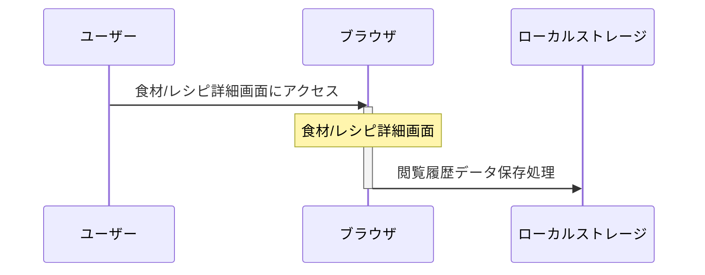
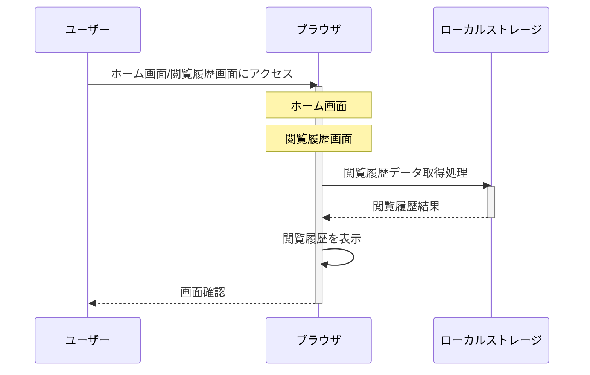

### 閲覧履歴の記録フロー
ユーザーが見たアイテムが自動で記録される際の流れです。

```mermaid
sequenceDiagram
    participant User as ユーザー
    participant Browser as ブラウザ
    participant LocalStorage as ローカルストレージ

    User->>Browser: 食材/レシピ詳細画面にアクセス
    activate Browser
    note over Browser:食材/レシピ詳細画面
    Browser->>LocalStorage: 閲覧履歴データ保存処理
    deactivate Browser
```

### 閲覧履歴の表示フロー
ユーザーが見たアイテムが表示される際の流れです。

```mermaid
sequenceDiagram
    participant User as ユーザー
    participant Browser as ブラウザ
    participant LocalStorage as ローカルストレージ

    User->>Browser: ホーム画面/閲覧履歴画面にアクセス
    activate Browser
    note over Browser:ホーム画面
    note over Browser:閲覧履歴画面
    
    Browser->>LocalStorage: 閲覧履歴データ取得処理
    activate LocalStorage
    LocalStorage-->>Browser: 閲覧履歴結果
    deactivate LocalStorage
    
    Browser->>Browser: 閲覧履歴を表示
    Browser-->>User:画面確認
    deactivate Browser
```