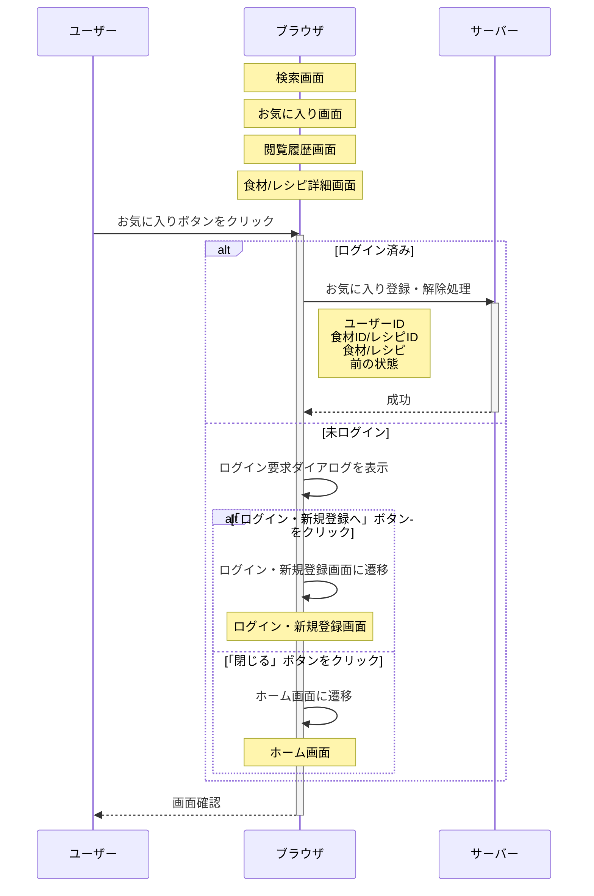

### お気に入り登録・解除フロー
ユーザーがアイテムをお気に入りに登録・解除する際の流れです。

```mermaid
sequenceDiagram
    participant User as ユーザー
    participant Browser as ブラウザ
    participant Supabase as サーバー

    note over Browser:検索画面
    note over Browser:お気に入り画面
    note over Browser:閲覧履歴画面
    note over Browser:食材/レシピ詳細画面

    User->>Browser: お気に入りボタンをクリック
    activate Browser
    
    alt ログイン済み
        Browser->>Supabase: お気に入り登録・解除処理
        activate Supabase
        note right of Browser:ユーザーID<br/>食材ID/レシピID<br/>食材/レシピ<br/>前の状態
        Supabase-->>Browser: 成功
        deactivate Supabase
    else 未ログイン
        Browser->>Browser: ログイン要求ダイアログを表示
        
        alt 「ログイン・新規登録へ」ボタンをクリック
            Browser->>Browser:ログイン・新規登録画面に遷移
            note over Browser:ログイン・新規登録画面
        else 「閉じる」ボタンをクリック
            Browser->>Browser:ホーム画面に遷移
            note over Browser:ホーム画面
        end

    end

    Browser-->>User: 画面確認
    deactivate Browser
```

