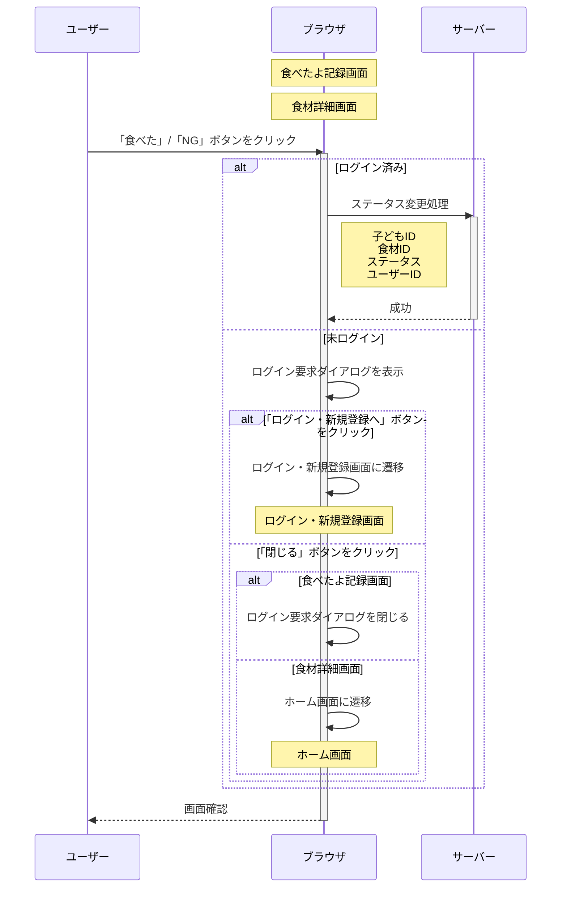

### 食材ステータス変更フロー
ユーザーが食材のステータス（食べた、NG）を記録する際の流れです。

```mermaid
sequenceDiagram
    participant User as ユーザー
    participant Browser as ブラウザ
    participant Supabase as サーバー

    note over Browser:食べたよ記録画面
    note over Browser:食材詳細画面
    User->>Browser: 「食べた」/「NG」ボタンをクリック
    activate Browser

    alt ログイン済み
        Browser->>Supabase: ステータス変更処理
        activate Supabase
        note right of Browser:子どもID<br/>食材ID<br/>ステータス<br/>ユーザーID
        Supabase-->>Browser: 成功
        deactivate Supabase
    else 未ログイン
        Browser->>Browser: ログイン要求ダイアログを表示
        
        alt 「ログイン・新規登録へ」ボタンをクリック
            Browser->>Browser:ログイン・新規登録画面に遷移
            note over Browser:ログイン・新規登録画面
        else 「閉じる」ボタンをクリック
        
            alt 食べたよ記録画面
                Browser->>Browser:ログイン要求ダイアログを閉じる
            else 食材詳細画面
                Browser->>Browser:ホーム画面に遷移
                note over Browser:ホーム画面
            end
        
        end
        
    end

    Browser-->>User: 画面確認
    deactivate Browser
```
