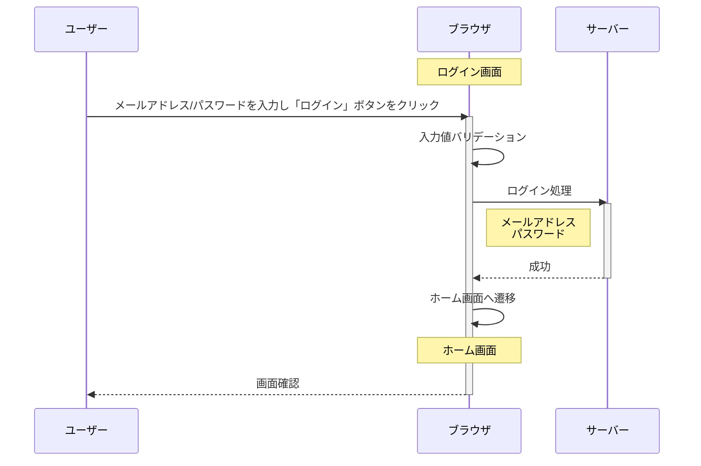
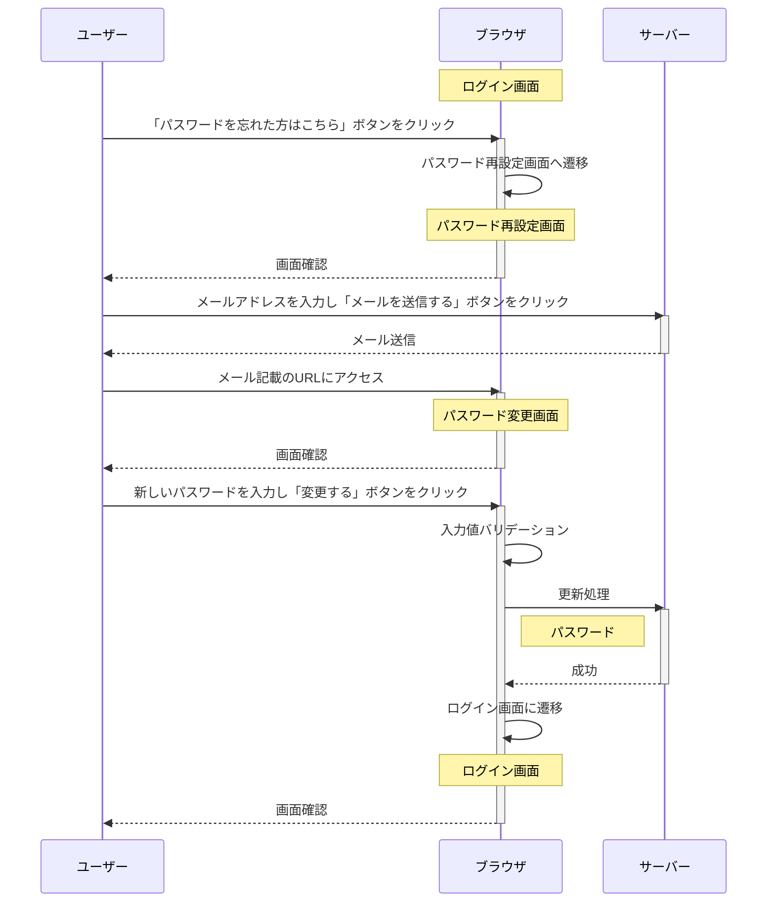
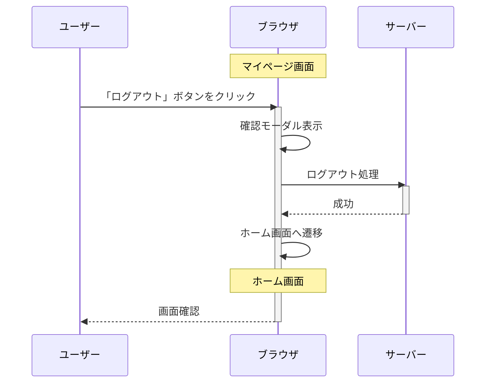

### ログインフロー
既存ユーザーがログインする際の流れです。

```mermaid
sequenceDiagram
    participant User as ユーザー
    participant Browser as ブラウザ
    participant Supabase as サーバー

    note over Browser:ログイン画面
    User->>Browser: メールアドレス/パスワードを入力し「ログイン」ボタンをクリック
    activate Browser
    Browser->>Browser: 入力値バリデーション
    
    Browser->>Supabase: ログイン処理
    activate Supabase
    note right of Browser:メールアドレス<br/>パスワード
    Supabase-->>Browser: 成功
    deactivate Supabase
    
    Browser->>Browser: ホーム画面へ遷移
    note over Browser:ホーム画面
    Browser-->>User: 画面確認
    deactivate Browser
```

### パスワード再設定フロー
既存ユーザーがパスワードを再設定する際の流れです。

```mermaid
sequenceDiagram
    participant User as ユーザー
    participant Browser as ブラウザ
    participant Supabase as サーバー

    note over Browser:ログイン画面
    User->>Browser: 「パスワードを忘れた方はこちら」ボタンをクリック
    activate Browser
    Browser->>Browser: パスワード再設定画面へ遷移
    note over Browser:パスワード再設定画面
    Browser-->>User: 画面確認
    deactivate Browser
    
    User->>Supabase: メールアドレスを入力し「メールを送信する」ボタンをクリック
    activate Supabase
    Supabase-->>User: メール送信
    deactivate Supabase
    
    User->>Browser:メール記載のURLにアクセス
    activate Browser
    note over Browser:パスワード変更画面
    Browser-->>User: 画面確認
    deactivate Browser

    User->>Browser: 新しいパスワードを入力し「変更する」ボタンをクリック
    activate Browser
    Browser->>Browser: 入力値バリデーション

    Browser->>Supabase: 更新処理
    activate Supabase
    note right of Browser:パスワード
    Supabase-->>Browser: 成功
    deactivate Supabase

    Browser->>Browser: ログイン画面に遷移
    note over Browser:ログイン画面
    Browser-->>User: 画面確認
    deactivate Browser
```

### ログアウトフロー
既存ユーザーがログアウトする際の流れです。

```mermaid
sequenceDiagram
    participant User as ユーザー
    participant Browser as ブラウザ
    participant Supabase as サーバー

    note over Browser:マイページ画面
    User->>Browser: 「ログアウト」ボタンをクリック
    activate Browser
    Browser->>Browser: 確認モーダル表示
    Browser->>Supabase: ログアウト処理
    activate Supabase
    Supabase-->>Browser: 成功
    deactivate Supabase
    Browser->>Browser: ホーム画面へ遷移
    note over Browser:ホーム画面
    Browser-->>User: 画面確認
    deactivate Browser
```
