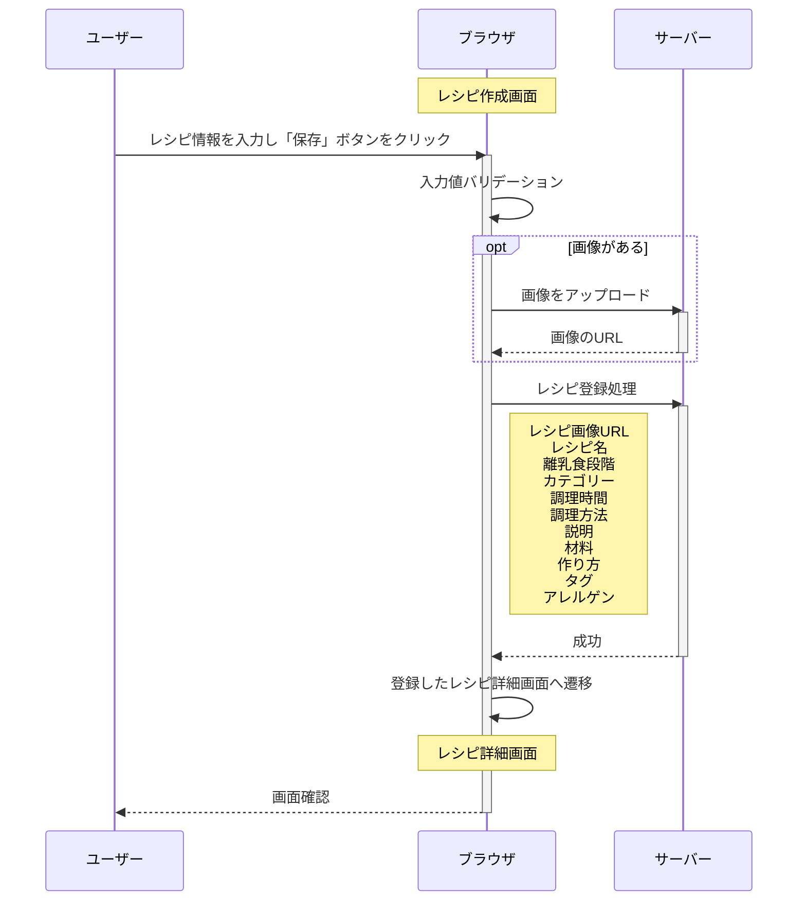
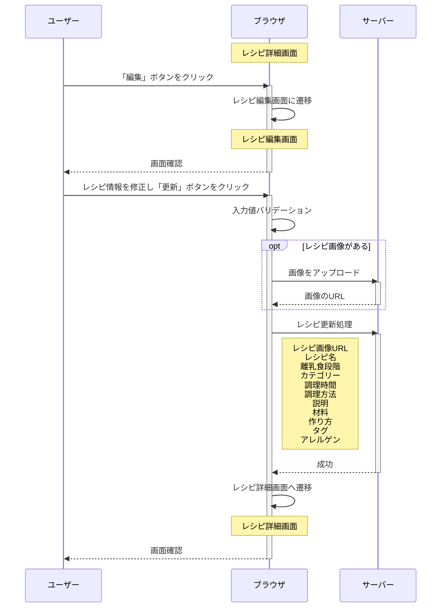
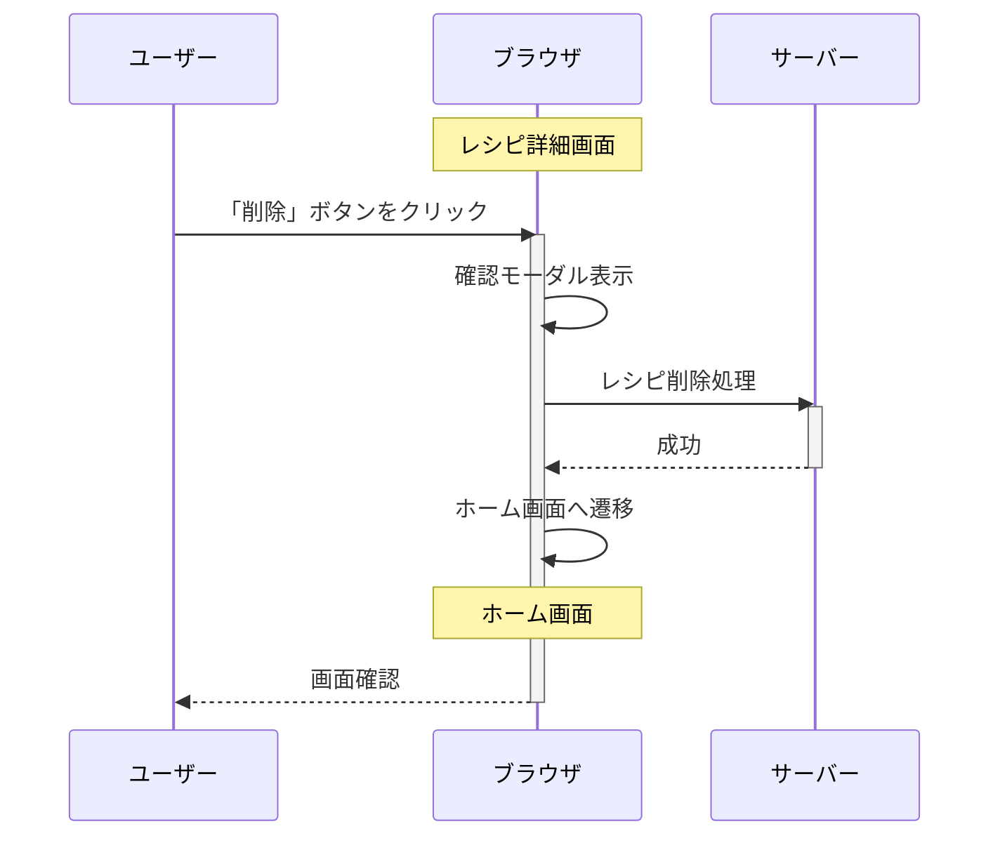

### レシピ作成フロー
ユーザーが新しいレシピを作成する際の流れです。

```mermaid
sequenceDiagram
    participant User as ユーザー
    participant Browser as ブラウザ
    participant Supabase as サーバー

    note over Browser:レシピ作成画面
    User->>Browser: レシピ情報を入力し「保存」ボタンをクリック
    activate Browser

    Browser->>Browser:入力値バリデーション

opt 画像がある
    Browser->>Supabase: 画像をアップロード
    activate Supabase
    Supabase-->>Browser: 画像のURL
    deactivate Supabase
    end
    
    Browser->>Supabase: レシピ登録処理
    activate Supabase
    note right of Browser:レシピ画像URL<br/>レシピ名<br/>離乳食段階<br/>カテゴリー<br/>調理時間<br/>調理方法<br/>説明<br/>材料<br/>作り方<br/>タグ<br/>アレルゲン
    Supabase-->>Browser: 成功
    deactivate Supabase
    
    Browser->>Browser: 登録したレシピ詳細画面へ遷移
    note over Browser:レシピ詳細画面
    Browser-->>User:画面確認
    deactivate Browser
```

### レシピ更新フロー
ユーザーが既存のレシピを更新する際の流れです。

```mermaid
sequenceDiagram
    participant User as ユーザー
    participant Browser as ブラウザ
    participant Supabase as サーバー

    note over Browser:レシピ詳細画面
    User->>Browser: 「編集」ボタンをクリック
    activate Browser
    Browser->>Browser:レシピ編集画面に遷移
    note over Browser:レシピ編集画面
    Browser-->>User: 画面確認
    deactivate Browser
    
    User->>Browser:レシピ情報を修正し「更新」ボタンをクリック
    activate Browser

    Browser->>Browser:入力値バリデーション

    opt レシピ画像がある
        Browser->>Supabase: 画像をアップロード
        activate Supabase
        Supabase-->>Browser: 画像のURL
        deactivate Supabase
    end
    
    Browser->>Supabase: レシピ更新処理
    activate Supabase
    note right of Browser:レシピ画像URL<br/>レシピ名<br/>離乳食段階<br/>カテゴリー<br/>調理時間<br/>調理方法<br/>説明<br/>材料<br/>作り方<br/>タグ<br/>アレルゲン
    Supabase-->>Browser: 成功
    deactivate Supabase
    
    Browser->>Browser: レシピ詳細画面へ遷移
    note over Browser:レシピ詳細画面
    Browser-->>User: 画面確認
    deactivate Browser
```

### レシピ削除フロー
ユーザーが既存のレシピを削除する際の流れです。

```mermaid
sequenceDiagram
    participant User as ユーザー
    participant Browser as ブラウザ
    participant Supabase as サーバー

    note over Browser:レシピ詳細画面
    User->>Browser: 「削除」ボタンをクリック
    activate Browser
    Browser->>Browser: 確認モーダル表示
    
    Browser->>Supabase: レシピ削除処理
    activate Supabase
    Supabase-->>Browser: 成功
    deactivate Supabase
    
    Browser->>Browser: ホーム画面へ遷移
    note over Browser:ホーム画面
    Browser-->>User:画面確認
    deactivate Browser
```