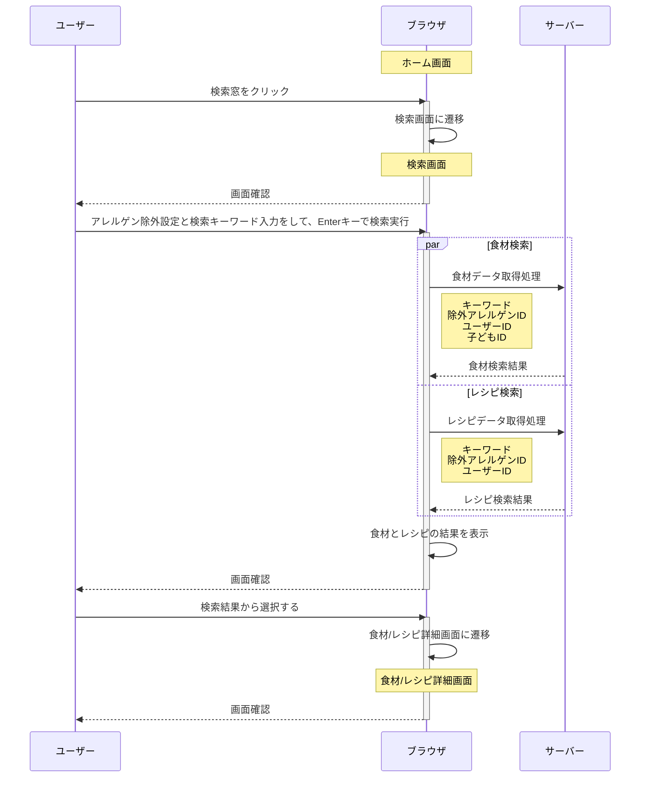

### 食材/レシピ検索フロー
ユーザーがキーワードとアレルゲン除外設定を使って、食材やレシピを検索する際の流れです。

```mermaid
sequenceDiagram
    participant User as ユーザー
    participant Browser as ブラウザ
    participant Supabase as サーバー

    note over Browser:ホーム画面
    User->>Browser: 検索窓をクリック
    activate Browser
    Browser->>Browser: 検索画面に遷移
    note over Browser:検索画面
    Browser-->>User: 画面確認
    deactivate Browser
    
    User->>Browser: アレルゲン除外設定と検索キーワード入力をして、Enterキーで検索実行
    activate Browser
    
    par 食材検索
        Browser->>Supabase: 食材データ取得処理
        note right of Browser: キーワード<br/>除外アレルゲンID<br/>ユーザーID<br/>子どもID
        Supabase-->>Browser: 食材検索結果
    and レシピ検索
        Browser->>Supabase: レシピデータ取得処理
        note right of Browser: キーワード<br/>除外アレルゲンID<br/>ユーザーID
        Supabase-->>Browser: レシピ検索結果
    end

    Browser->>Browser: 食材とレシピの結果を表示
    Browser-->>User: 画面確認
    deactivate Browser

    User->>Browser: 検索結果から選択する
    activate Browser
    Browser->>Browser: 食材/レシピ詳細画面に遷移
    note over Browser:食材/レシピ詳細画面
    Browser-->>User: 画面確認
    deactivate Browser

```