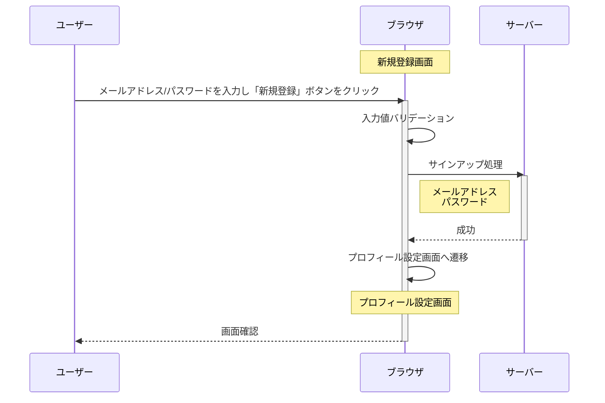

### 新規登録フロー
ユーザーがメールアドレスとパスワードで新しくアカウントを作成する際の流れです。

```mermaid
sequenceDiagram
    participant User as ユーザー
    participant Browser as ブラウザ
    participant Supabase　as サーバー

    note over Browser:新規登録画面
    User->>Browser: メールアドレス/パスワードを入力し「新規登録」ボタンをクリック
    activate Browser
    Browser->>Browser: 入力値バリデーション
    Browser->>Supabase: サインアップ処理
    activate Supabase
    note right of Browser:メールアドレス<br/>パスワード
    Supabase-->>Browser: 成功
    deactivate Supabase
    Browser->>Browser: プロフィール設定画面へ遷移
    note over Browser:プロフィール設定画面
    Browser-->>User: 画面確認
    deactivate Browser
```