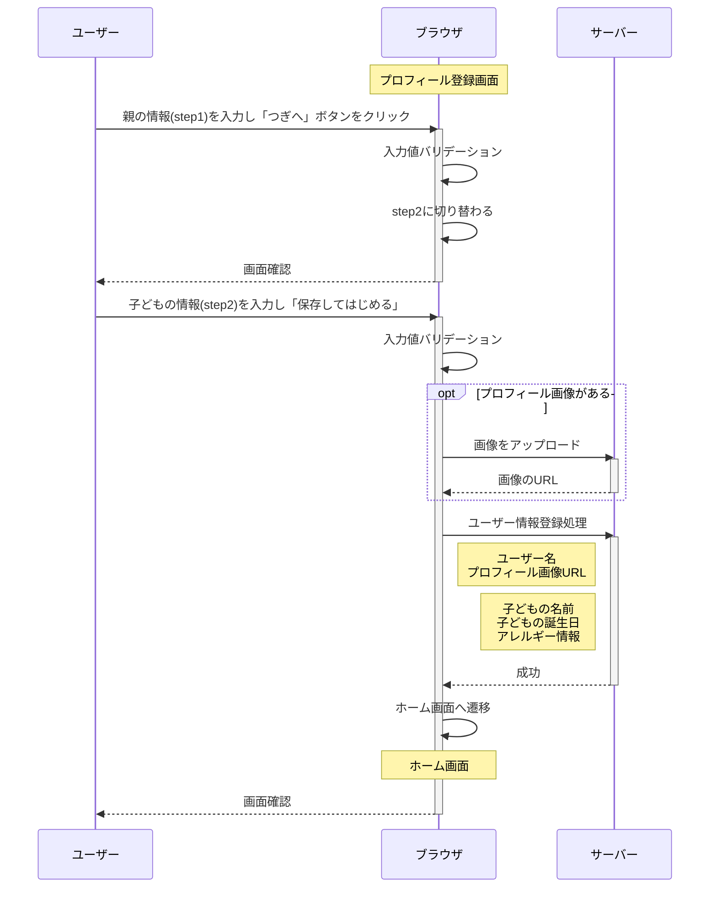
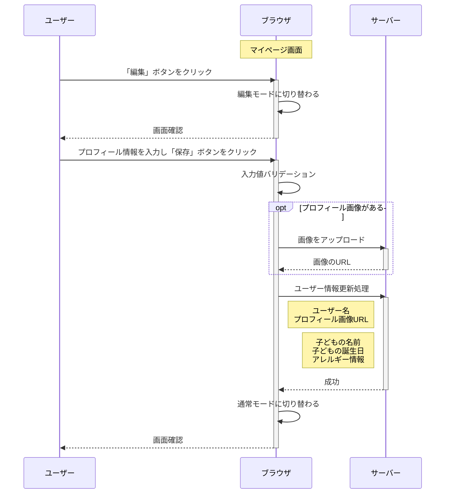
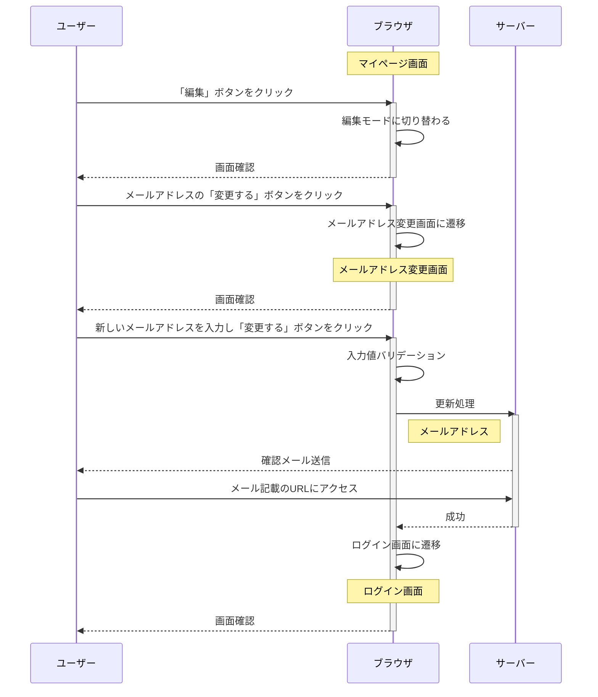
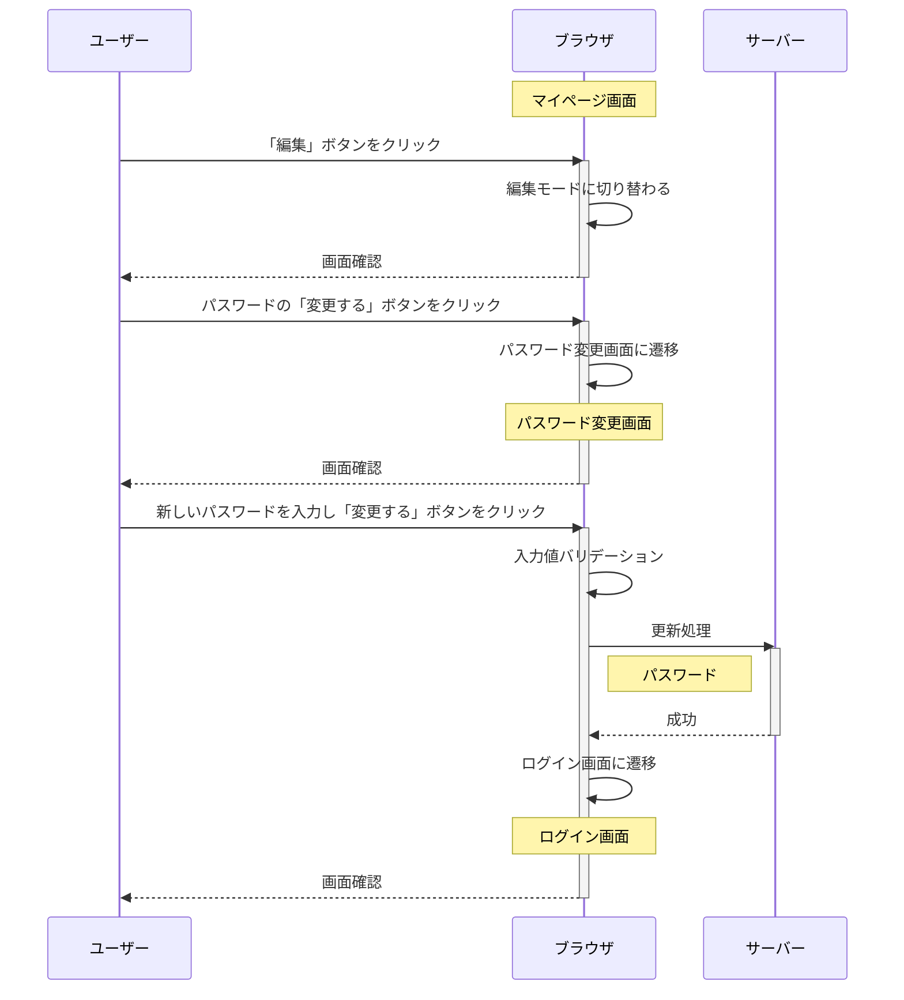

### ユーザー情報登録フロー
ユーザーが新規登録後に自身や子どもの情報を初期設定する際の流れです。

### ユーザー情報更新フロー（メールアドレス、パスワード以外）
ユーザーがメールアドレスやパスワード以外の自身や子どもの情報を更新する際の流れです。

### ユーザー情報更新フロー（メールアドレス）
ユーザーがメールアドレスを変更する際の流れです。

### ユーザー情報更新フロー（パスワード）
ユーザーがパスワードを変更する際の流れです。

